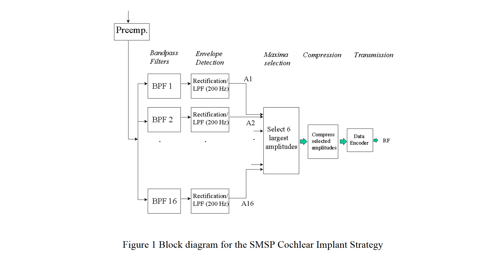
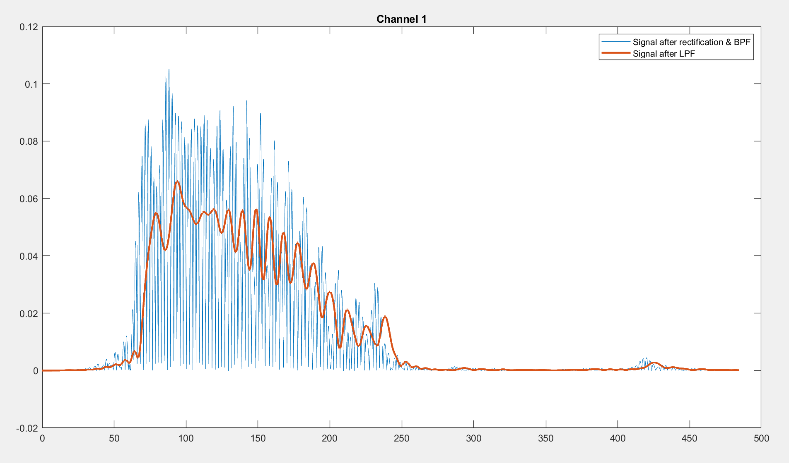
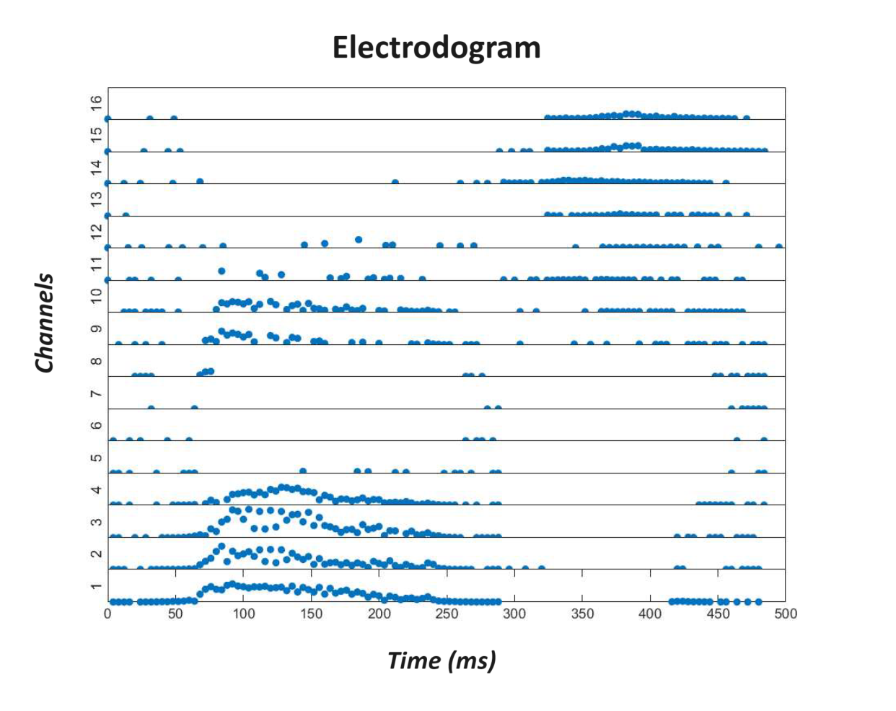
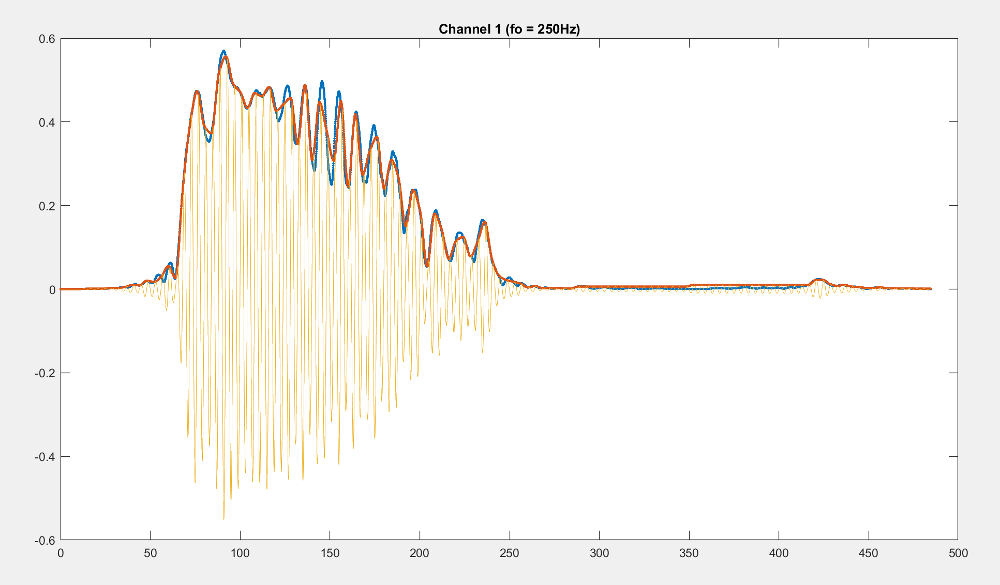
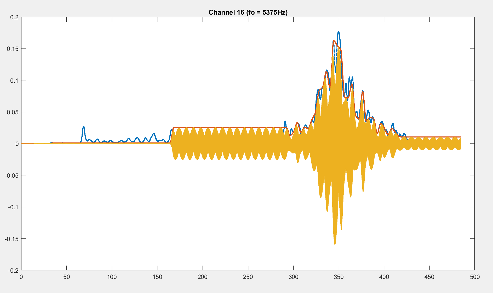
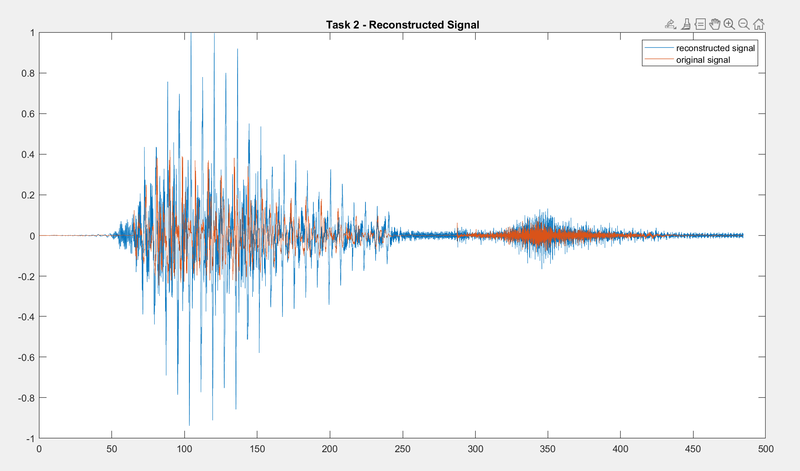
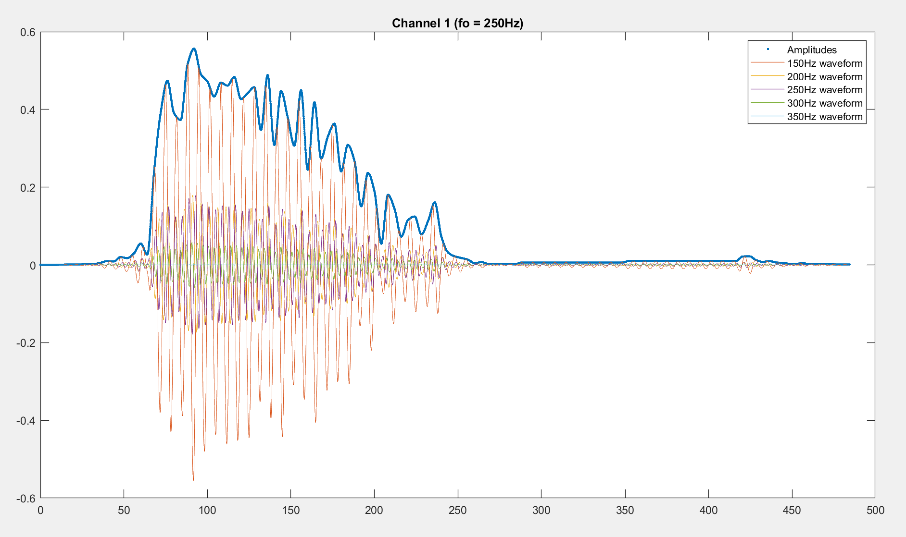
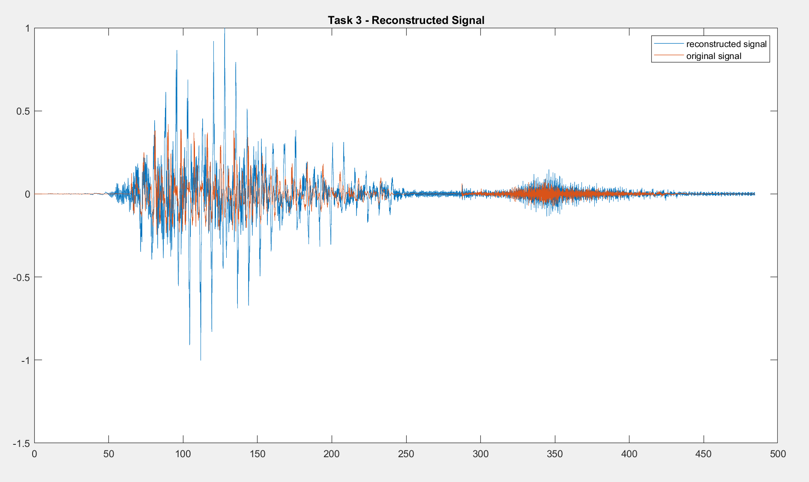

# Cochlear Implant Simulation

### **Background**
One speech processing strategy used in cochlear implant processors is the Spectral Maxima Sound Processor (SMSP). In this scheme, the speech waveform is analyzed using a bank of 16 band-pass filters and a spectral maxima detector. A block diagram for the operation of this
strategy is shown in Figure 1.



The signal from the microphone is first preprocessed by an amplifier to get a suitable dynamic range for the analogue-to-digital converter. The signal is then sent through a bank of 16 band-pass filters with center frequencies ranging from 250 to 5.4 KHz. The output of the filter is rectified and low-pass filtered with a cutoff frequency of 200 Hz. After computing all 16 filter outputs, the SMSP processor selects, at 4msec intervals, the six largest filter outputs.
The six amplitudes are compressed logarithmically with the result transmitted to the electrode array through a radio link. The output of each of the filters is allocated to each electrode. The apical electrode is allocated to the filter with the lowest center frequency, while the basal electrode is allocated to the filter with the highest center frequency. Only the 16 most-apical electrodes are activated, while the remaining basal electrodes in the 22-electrode implant are left inactive.

After the amplitude selection stage, amplitudes have to be mapped for individual patients for all the filter outputs. The patients map ranges form a threshold level to a comfort level. These to levels are commonly referred to T and C levels. The Threshold is the minimum level that a patient can hear and the C level is the maximum level that a patient can hear without discomfort. The mapping function for each channel is given by,


Where A is the mapped amplitude and x is the input amplitude that ranges from 0 to 1. For this experiment, it was assumed that T=0 and C=1.

Electrodes are stimulated one at a time. The order the six chosen electrodes stimulate the nerve ending is from the biggest to smallest amplitude. Hence every 4msecs six electrodes are stimulated. A useful tool to analysis the cochlear implant strategy is the electrodogram,
which show each electrode is stimulated over the evolution of time.

## **TASK 1**
### **Introduction**
The task was to write a matlab simulation for the SMSP strategy and display an electrodogram after the mapping function, but before the compression stage. The filter requirements were:

- is linear phase
- the center frequencies for the 16 band-pass filters are: 250Hz, 375Hz, 500Hz, 625Hz, 750Hz, 937Hz, 1187Hz , 1437Hz, 1687Hz , 2000Hz, 2375Hz, 2812Hz, 3312Hz, 3875Hz, 4563Hz, 5375Hz
-  the corresponding bandwidths for the 16 filters are: 124Hz, 126Hz, 124Hz,126Hz, 124Hz, 250Hz, 250Hz, 250Hz, 250Hz, 376Hz, 374Hz, 500Hz, 500Hz, 626Hz, 750Hz, 874Hz 

A test signal was provided, mbet.wav. The signal had to be resampled at 16 KHz.

### **Method**
```matlab
% TASK 1
% Load audio
[y,fs_original]=audioread('mbet.wav');
sound(y,fs_original);

% Calculate the duration of the audio file
duration = length(y) / fs_original; % Calculate the duration in seconds
t_original = (0:1/fs_original:duration)*1000; % Original time vector (484.4ms)

% Choose new sampling frequency and update the time vector
fs_new = 16000;
t_new = (0:1/fs_new:duration)*1000; % Desired time vector to match new sampling frequency (484.4ms)

% Resample at new sampling frequency (16kHz)
y1 = resample(y,fs_new,fs_original);

% Define center frequencies and bandwidths
center_frequencies = [250 375 500 625 750 937 1187 1437 1687 2000 2375 2812 3312 3875 4563 5375];
bandwidths = [124 126 124 126 124 250 250 250 250 376 374 500 500 626 750 874];

% Design low pass filter
Fc = 200; % Cutoff frequency (Hz)
N = 101; % Filter order (odd for symmetric FIR)

% Design the filter using the FIR filter design function
LPF = fir1(N, Fc/(fs_new/2), 'low');

% Apply a bandpass filter to each channel respectively
channels = [];
for i = 1:16
    % Get lower and upper frequency
    fL = center_frequencies(i) - 0.5*bandwidths(i);
    fH = center_frequencies(i) + 0.5*bandwidths(i);

    % Rectify signal and apply bandpass filter
    channel = abs(bandpass(y1,[fL,fH],fs_new));

    % Apply low pass filter
    channel = filter(LPF, 1, channel).';
    channels=[channels; channel];
end

% Normalise the signal
channels = channels./max(channels,[],"all");

% Map the amplitudes using the mapping function
C = 1;
T = 0;
A = (C - T)*channels + T;

% Sample every 4ms (equivalent to every 64th value for Fs of 16kHz) (also called decimation)
channels2 = A(:,1:64:end);

% Select the 6 largest filter outputs every 4ms
channels3 = NaN(size(channels2));
for i = 1:length(channels2)
    % Sort the amplitudes
    [sorted_case, sorted_channel_indices] = sort(channels2(:,i), 'descend');
    % Select the highest 6 values from sorted amplitudes
    for k = 1:6
        channels3(sorted_channel_indices(k),i) = sorted_case(k);
    end
end

% Update the time vector
t_new2 = (0:64/(fs_new):duration)*1000; % (484.4ms)

% Plot electrodogram
figure;
tlo = tiledlayout("vertical", 'Padding', 'none', 'TileSpacing', 'none');
for i = 16:-1:2
    nexttile(tlo);
    plot(t_new2,channels3(i,:),'.','MarkerSize',15)
    set(gca,'XTick',[], 'YTick', [])
    ylabel(i)
    ylim([0,1]);
end
nexttile(tlo);
plot(t_new2,channels3(1,:),'.','MarkerSize',15)
set(gca, 'YTick', [])
ylabel(1)
ylim([0,1]);
```
<div style="page-break-after: always;"></div>

### **Analysis & Results**
The figure below shows an example of the signal in a channel (in this case, Channel 1). As specified in the method, the signal was filtered using a bandpass filter and then rectified (blue). An enveloppe is then created by passing this signal through a low pass filter (orange).



After selecting the 6 greatest amplitude values every 4ms, an electrodogram was plotted as follows:



### **Discussion & Conclusion**
When looking at the electrodogram, it can be seen that parts of the signal with lower frequencies were captured by channels 1 to 4. These parts correspond to the pronounciation of the letter "b" from the word "bet". The letter "e" was then captured by channels 5 to 11. Finally, the higher ferquencies for the letter "t" was captured by channels 12 to 16.

<div style="page-break-after: always;"></div>

## **TASK 2**
### **Introduction**
The task was to recreate the speech waveform from the spiking information obtained in Task 1. The amplitude of the sinusoid was related to the amplitude of the spike. Therefore, the resulting waveform was the summation of the generated waveform from each filter.

### **Method**
```matlab
% TASK 2
channels4 = [];
figure;

% Iterate over each spike
for i = 1:16
    % Use the filter's center frequency for the channel's waveform
    frequency = center_frequencies(i);

    % Interpolate amplitudes of channel to remove NaN values
    % Choose 'nearest' method (works best)
    amplitude = fillmissing(channels3(i,:),'nearest');

    % Interpolate amplitudes again with time vector to achieve correct timing
    % Initial time vector
    original_time = linspace(0, 484.4, length(amplitude));
    % Desired time vector with correct length
    desired_time = linspace(0, 484.4, length(A));
    % Choose 'pchip' method (works best)
    amplitude = interp1(original_time, amplitude, desired_time, 'pchip');

    % Generate waveform for channel
    sinusoid = amplitude.*sin(2*pi*[1:length(amplitude)]*frequency/fs_new);
    channels4(i,:) = sinusoid;
end

% Sum up generated waveforms
y2 = sum(channels4,1);
% Normalise the reconstructed signal
y2 = y2./max(y2);

% Plot and listen to reconstructed signal
plot(desired_time,y2)
hold on;
plot(t_new,y1)
sound(y2,fs_new);
title("Task 2 - Reconstructed Signal")
legend("reconstructed signal","original signal")
```
<div style="page-break-after: always;"></div>

### **Analysis & Results**
The two figures below demonstrate how the sine wave was reconstructed for each channel based on the amplitudes obtained from each channel and their respective center frequency. This is visible where the waveform for channel 1 oscillates at a lower frequency than channel 16. Additionally, the blue curve represents the signal before the 6 highest amplitudes were selected. The orange curve represents the signal after the 6 highest amplitudes were selected with interpolation.





The following figure compares the reconstructed signal to the original. It should be noted that the reconstructed signal sounded very robotic.




### **Discussion & Conclusion**
When comparing the reconstructed signal to the original, they roughly follow the same shape and sound. However, since a large amount of information from the original signal was lost when selecting the 6 highest amplitudes, they are not identical. This poor reconstruction of the signal is also due to the fact of only using 16 frequencies (center frequency of each channel's filter) to reconstruct the entire signal.

<div style="page-break-after: always;"></div>

## **TASK 3**
### **Introduction**
At present a limitation in quality of the sound is reduced because the electrode stimulations do not activate other nerve endings along the basilar membrane. Therefore, this task was to incorporate over stimulation of nerve ending in the reconstruction of the waveform. This was achieved by reconstructing the signal not only by the frequency corresponding to the frequency of the electrode, but with a signal that has a spread of frequencies centered about the electrode frequency. The magnitude of the stimulation spread function was assumed to be Gaussian in frequency spread with a width of 200 Hz around the stimulation frequency.

### **Method**
```matlab
% TASK 3
channels5 = [];
figure;
% NOTE: 99.7% of data observed following a normal distribution lies within 3 standard deviations of the mean. Therefore, by following this rule we can define the standard deviation for the Gaussian function as follows:
std = 100/3;

% Iterate over each spike like in Task 2
for i = 1:16
    
    % Define shifts from -100 to 100 around center frequency
    shifts = -100:1:100;

    % Use the filter's center frequency for the channel's waveform
    center_frequency = center_frequencies(i);

    % Interpolate amplitudes of channel to remove NaN values
    % Choose 'nearest' method (works best)
    amplitude = fillmissing(channels3(i,:),'nearest');

    % Interpolate amplitudes again with time vector to achieve correct timing
    % Initial time vector
    original_time = linspace(0, 484.4, length(amplitude));
    % Desired time vector with correct length
    desired_time = linspace(0, 484.4, length(A));
    % Choose 'pchip' method (works best)
    amplitude = interp1(original_time, amplitude, desired_time, 'pchip');

    sinusoids = zeros(size(amplitude));
    for shift = shifts
        % Apply shift
        frequency = center_frequency + shift;
        mean = frequency;

        % Get factor and normalise using it by making the center frequency's
        % amplitude equal to "1"
        factor = (1/(std*sqrt(2*pi)))*exp((-0.5*(mean-shift-mean)^2)/std^2)/(1/(std*sqrt(2*pi)))*exp((-0.5*(mean-mean)^2)/std^2);
        % Adjust amplitude to the Gaussian function
        amplitude = factor*amplitude;

        % Generate waveform for channel
        sinusoid = amplitude.*sin(2*pi*[1:length(amplitude)]*frequency/fs_new);
        % Sum up sinusoids for the channel
        sinusoids = sinusoids + sinusoid;
    end
    channels5(i,:) = sinusoids;
end

% Sum up generated waveforms
y3 = sum(channels5,1);
% Normalise the reconstructed signal
y3 = y3./max(y3);

% Plot and listen to reconstructed signal
plot(desired_time,y3)
hold on;
plot(t_new,y1)
sound(y3,fs_new);
title("Task 3 - Reconstructed Signal")
legend("reconstructed signal","original signal")
```

### **Analysis & Results**
The figure below demonstrates an example of how more frequencies surrounding the center frequency of the specified channel could be added using the Gaussian function. It should be noted that only 4 frequencies were added for this demonstration (easier to visualise) but 200 frequencies were added in reality (this is determined by the interval in the "shifts" array).



The following figure compares the reconstructed signal to the original. It should be noted that the reconstructed signal sounded less robotic than in Task 2.



<div style="page-break-after: always;"></div>

### **Discussion & Conclusion**
When comparing the reconstructed signal to the original, they follow more closely the same shape and sound than in Task 2. However, since a large amount of information from the original signal was lost when selecting the 6 highest amplitudes, they are not identical. This reconstruction of the signal is better and smoother than in Task 2 as it has more frequencies being used. The Gaussian function also allows the use of the additional frequencies to follow a normal distribution, making the reconstructed signal sound more natural.
